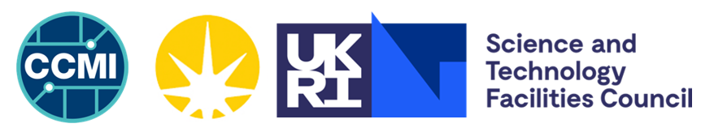
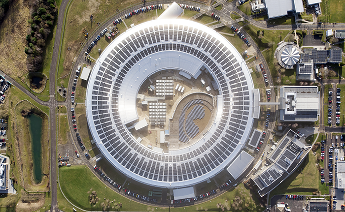
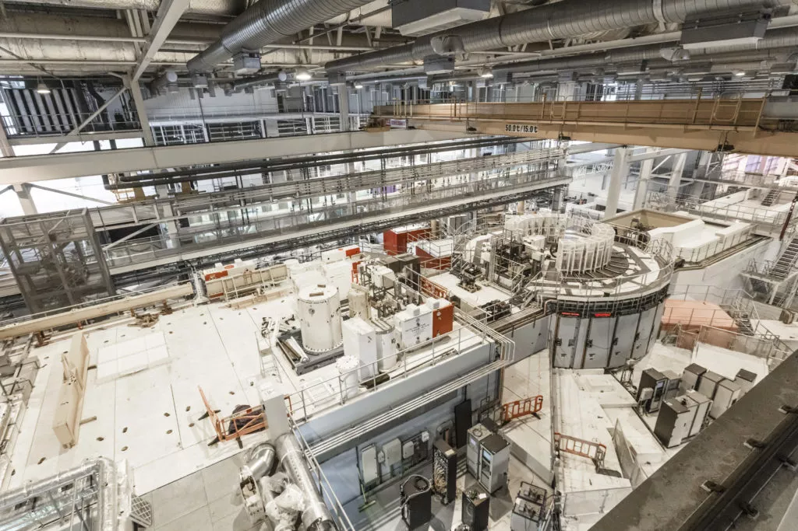

# About the Organizations

This page provides a brief overview of the host organizations, the scientific facilities, and the visiting Centre for Doctoral Training for the Rutherford Appleton Laboratory site visit on **Tuesday, 26th May 2026**.

---

## Collaborative Computational Modelling at the Interface (CCMI) CDT

[**Collaborative Computational Modelling at the Interface (CCMI)**](https://ccmi-cdt.org/) is a collaboration between University College London and Imperial College London. It offers a novel and innovative PhD training programme at the interface of computational modelling, data sciences, and research software engineering. 

> **The Software Journey:** A core component of this programme where students collaborate on a diverse range of open-source software projects. Some are suggested by the students themselves, while others are driven by academics or industrial partners.

---

## Science and Technology Facilities Council (STFC)

The [**Science and Technology Facilities Council (STFC)**](https://www.stfc.ac.uk/) is a United Kingdom government agency that carries out research in science and engineering. It is one of the constituent councils of UK Research and Innovation (UKRI). 

STFC funds and operates large-scale scientific facilities, providing researchers in the UK and internationally with access to world-class equipment and expertise. 

> **Mission:** To deliver world-leading national and international research and innovation capabilities and, through those, discover the secrets of the Universe. 

Its major research and innovation campuses at Harwell (RAL) and Daresbury, along with research facilities across the UK and overseas, support fundamental research in astronomy, physics, computational science, and space science.

---

## Rutherford Appleton Laboratory (RAL)

The [**Rutherford Appleton Laboratory (RAL)**](https://www.stfc.ac.uk/about-us/rutherford-appleton-laboratory) is one of STFC's primary scientific research laboratories, located on the Harwell Science and Innovation Campus in Oxfordshire. 

The site is home to several major experimental facilities and computing centres.

### Facilities at RAL

During the day, the visitors will interact with several key areas of the laboratory:

| [**Ada Lovelace Centre (ALC)**](https://www.adalovelacecentre.ac.uk/) |
| :--- |
| Provides scientific computing expertise and innovation to help researchers using the STFC National Laboratories do bigger and better science. |

| [**Scientific Computing Department (SCD)**](https://www.sc.stfc.ac.uk/) |
| :--- |
| An international centre of excellence for advanced computing expertise and digital research infrastructure.   |

| [**Diamond Light Source**](https://www.diamond.ac.uk/Home.html) |
| :--- |
| The UK’s national synchrotron, serving scientists and researchers from around the world.   |

| [**ISIS Neutron and Muon Source**](https://www.isis.stfc.ac.uk/) |
| :--- |
| Enables researchers to explore materials down to the atomic level, providing insights to answer key scientific questions and drive innovations that benefit society.   |
