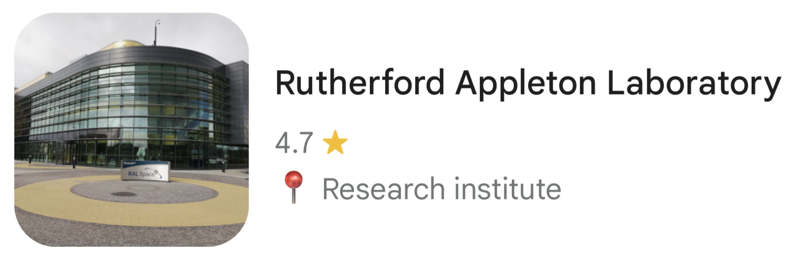

# Location

The postcode for the Rutherford Appleton Laboratory is **OX11 0QX**.

The nearest train station is Didcot, and the Thames travel X24/X34/X35 buses travel between Didcot Parkway Station and the Harwell Campus (~ 30 minute journey, with a bus every ~ 15 minutes). Taxis are also available at Didcot Parkway Station.

Detailed travel instructions are provided on the STFC ["How to Find Us"](https://www.ukri.org/who-we-are/stfc/facilities/rutherford-appleton-laboratory/how-to-get-to-rutherford-appleton-laboratory/#contents-list) page. The [official website](https://www.oxfordbus.co.uk/plan-your-journey) for the bus service can be used to plan your journey.

The hackathon will take place in the **R112 Visitor Centre** on the main Rutherford Appleton Laboratory site. On arrival, please report to reception and they will direct you to the right place. If driving, reception will direct you to a suitable place to park.

## Visitor ID needs to be shown on in order to access site.
All visitors are required to present an original photo ID when signing in at Reception. Photocopies or phone images are not accepted.

Acceptable forms of ID include:

-  A current and valid passport (UK or international)

-  UK photocard driving licence (full or provisional)

-  National identity cards (EEA countries issued under Council Regulation EC No. 2252/2004)

-  PASS-accredited photo ID cards (e.g. CitizenCard, Young Scot)

-  Ministry of Defence Form 90 (Defence Identity Card)

-  Northern Ireland electoral identity card

-  STFC/UKRI Issued pass

 
All documents must be within date of their validity.
